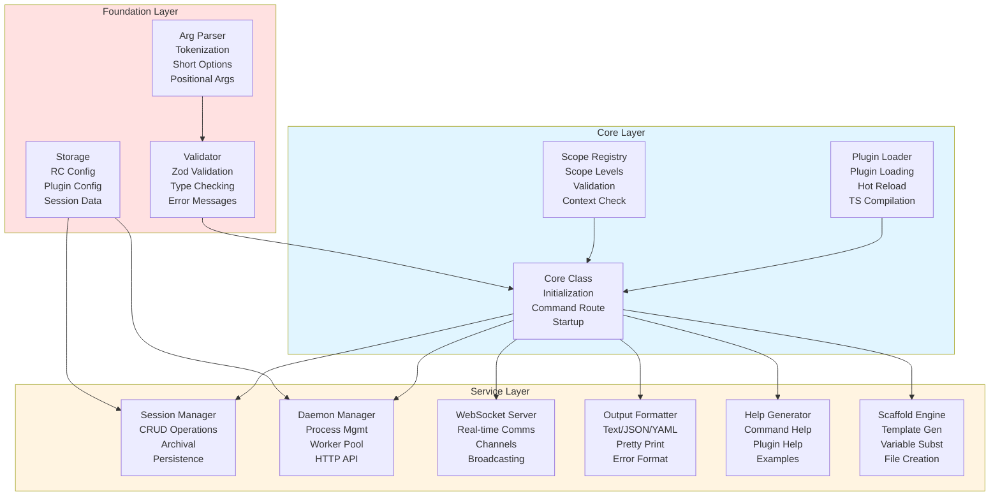
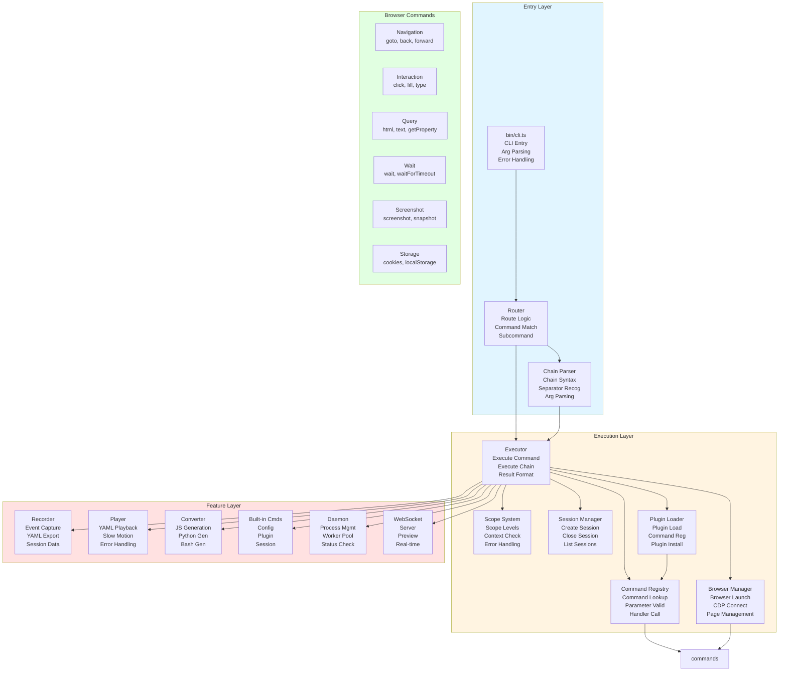
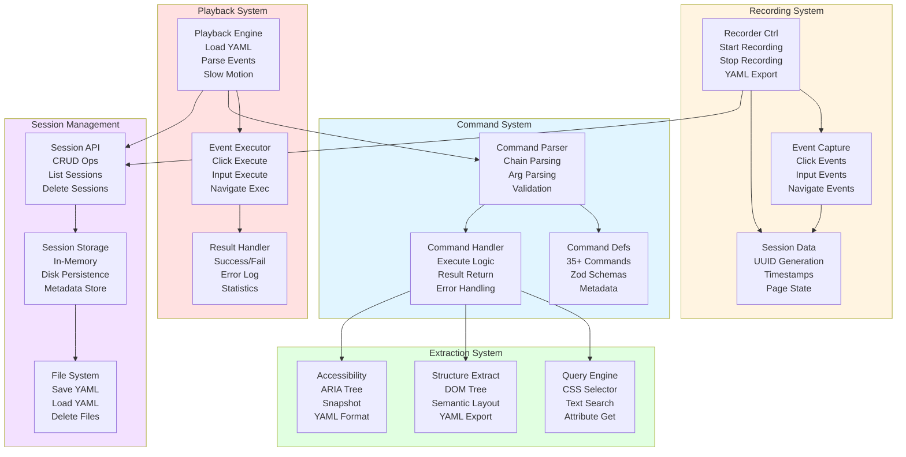
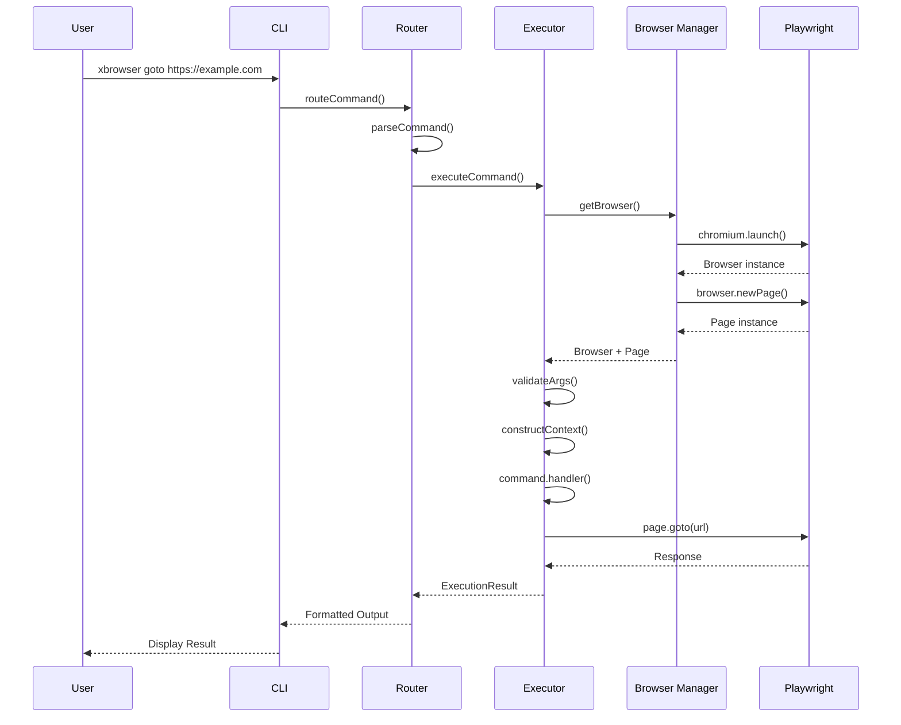
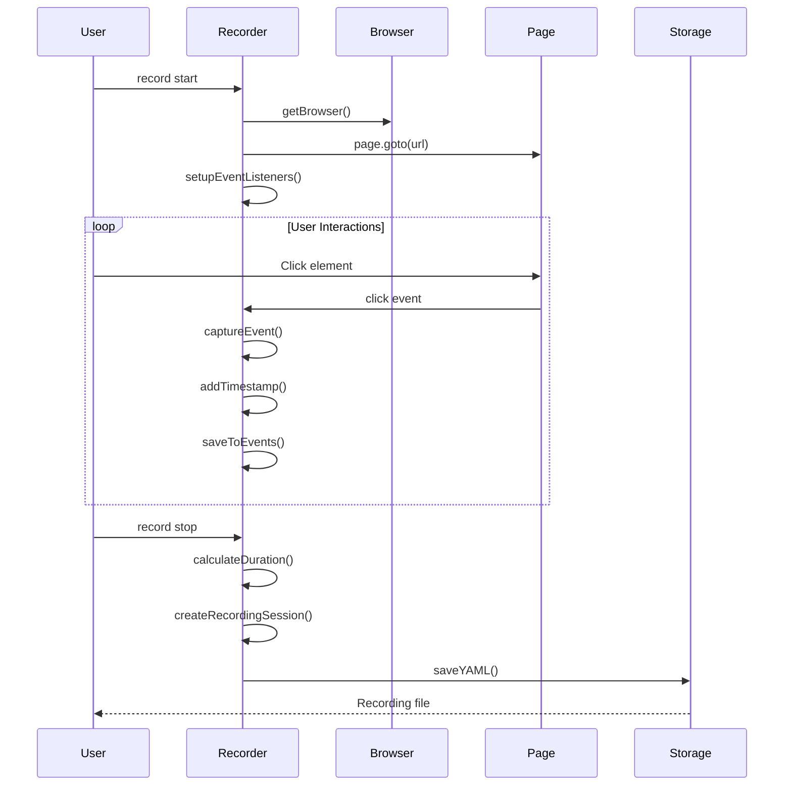
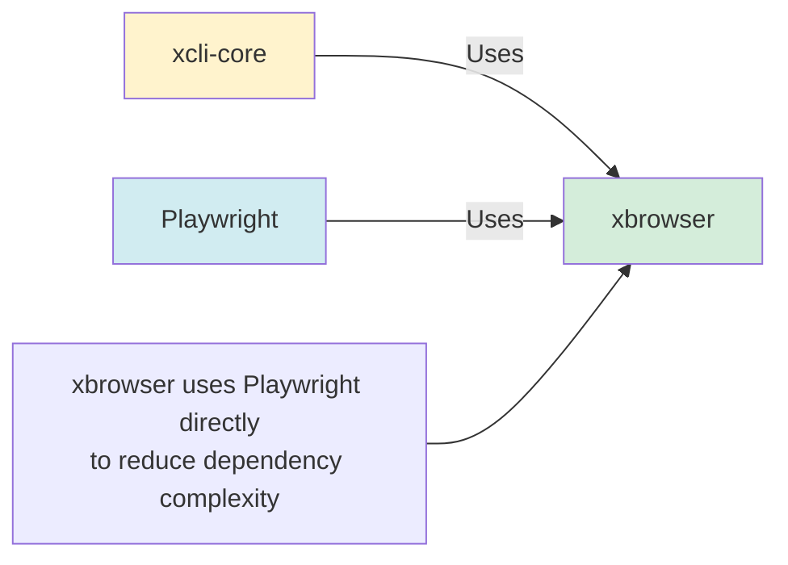

# Architecture Diagrams

Visual representation of the overall architecture for mpage, xcli-core, and xbrowser.

## Overall Architecture

```
┌─────────────────────────────────────────────────────────────────────┐
│                        Application Layer                            │
│                                                                   │
│  ┌─────────────────┐  ┌─────────────────┐  ┌─────────────────┐   │
│  │     xbrowser    │  │   Other Apps    │  │  Custom Apps    │   │
│  │                 │  │                 │  │                 │   │
│  │  Browser CLI    │  │  Database CLI   │  │  API Tools      │   │
│  │  Plugins        │  │  Scrapers       │  │  Automation     │   │
│  └────────┬────────┘  └────────┬────────┘  └────────┬────────┘   │
└───────────┼───────────────────┼───────────────────┼────────────────┘
            │                   │                   │
            ▼                   ▼                   ▼
┌─────────────────────────────────────────────────────────────────────┐
│                    Framework Layer                                 │
│                                                                   │
│              ┌─────────────────────────────┐                       │
│              │      @dyyz1993/xcli-core    │                       │
│              │                             │                       │
│              │  • Plugin System            │                       │
│              │  • Command Registration      │                       │
│              │  • Scope Management          │                       │
│              │  • Session Management        │                       │
│              │  • Daemon System             │                       │
│              │  • WebSocket Support         │                       │
│              │  • Output Formatting         │                       │
│              │  • Scaffolding               │                       │
│              └──────────────┬──────────────┘                       │
└───────────────────────────┼───────────────────────────────────────┘
                            │
                            ▼
┌─────────────────────────────────────────────────────────────────────┐
│                      Engine Layer                                  │
│                                                                   │
│  ┌─────────────────────────┐  ┌─────────────────────────────┐    │
│  │  @dyyz1993/xpage (mpage)│  │     Playwright             │    │
│  │                         │  │                             │    │
│  │  • Command Execution    │  │  • Browser Launch          │    │
│  │  • Recording/Playback   │  │  • Page Management         │    │
│  │  • Structure Extraction │  │  • Element Interaction      │    │
│  │  • Accessibility Tree   │  │  • CDP Connection          │    │
│  └─────────────────────────┘  └─────────────────────────────┘    │
└─────────────────────────────────────────────────────────────────────┘
                            │
                            ▼
┌─────────────────────────────────────────────────────────────────────┐
│                     Browser Layer                                  │
│                                                                   │
│  ┌─────────────────────────┐  ┌─────────────────────────────┐    │
│  │      Chromium           │  │      Chrome                 │    │
│  │                         │  │                             │    │
│  │  • CDP Endpoint         │  │  • Remote Debugging         │    │
│  │  • Headless Support     │  │  • Extension Support        │    │
│  └─────────────────────────┘  └─────────────────────────────┘    │
└─────────────────────────────────────────────────────────────────────┘
```

## Mermaid Diagram: Overall Architecture

```mermaid
graph TB
    subgraph Applications["Application Layer"]
        xbrowser[xbrowser<br/>Browser CLI]
        other[Other Apps<br/>Database CLI, Scrapers]
        custom[Custom Apps<br/>API Tools, Automation]
    end

    subgraph Framework["Framework Layer"]
        xcli[@dyyz1993/xcli-core<br/>Plugin System<br/>Command Registration<br/>Scope Management<br/>Session Management<br/>Daemon System<br/>WebSocket Support<br/>Output Formatting<br/>Scaffolding]
    end

    subgraph Engine["Engine Layer"]
        mpage[@dyyz1993/xpage<br/>Command Execution<br/>Recording/Playback<br/>Structure Extraction<br/>Accessibility Tree]
        playwright[Playwright<br/>Browser Launch<br/>Page Management<br/>Element Interaction<br/>CDP Connection]
    end

    subgraph Browser["Browser Layer"]
        chromium[Chromium<br/>CDP Endpoint<br/>Headless Support]
        chrome[Chrome<br/>Remote Debugging<br/>Extension Support]
    end

    xbrowser --> xcli
    other --> xcli
    custom --> xcli
    xcli --> mpage
    xcli --> playwright
    mpage --> playwright
    playwright --> chromium
    playwright --> chrome

    style Applications fill:#e1f5ff
    style Framework fill:#fff4e1
    style Engine fill:#ffe1e1
    style Browser fill:#e1ffe1
```

## xcli-Core Architecture

```
┌─────────────────────────────────────────────────────────────────────┐
│                      xcli-Core Framework                            │
└─────────────────────────────────────────────────────────────────────┘

┌─────────────────────────────────────────────────────────────────────┐
│                      Core Layer                                     │
│  ┌──────────────────┐  ┌──────────────────┐  ┌──────────────────┐  │
│  │   Core Class    │  │  Plugin Loader  │  │ Scope Registry   │  │
│  │                  │  │                  │  │                  │  │
│  │ • Initialization │  │ • Plugin Loading │  │ • Scope Levels   │  │
│  │ • Command Route  │  │ • Hot Reload    │  │ • Validation     │  │
│  │ • Startup        │  │ • TS Compilation│  │ • Context Check  │  │
│  └──────────────────┘  └──────────────────┘  └──────────────────┘  │
└─────────────────────────────────────────────────────────────────────┘

┌─────────────────────────────────────────────────────────────────────┐
│                     Service Layer                                   │
│  ┌──────────────────┐  ┌──────────────────┐  ┌──────────────────┐  │
│  │ Session Manager  │  │ Daemon Manager   │  │ WebSocket Server │  │
│  │                  │  │                  │  │                  │  │
│  │ • CRUD Operations│  │ • Process Mgmt   │  │ • Real-time Comms│  │
│  │ • Archival       │  │ • Worker Pool    │  │ • Channels       │  │
│  │ • Persistence    │  │ • HTTP API       │  │ • Broadcasting   │  │
│  └──────────────────┘  └──────────────────┘  └──────────────────┘  │
│                                                                   │
│  ┌──────────────────┐  ┌──────────────────┐  ┌──────────────────┐  │
│  │ Output Formatter│  │  Help Generator  │  │ Scaffold Engine  │  │
│  │                  │  │                  │  │                  │  │
│  │ • Text/JSON/YAML │  │ • Command Help   │  │ • Template Gen   │  │
│  │ • Pretty Print   │  │ • Plugin Help    │  │ • Variable Subst │  │
│  │ • Error Format   │  │ • Examples       │  │ • File Creation  │  │
│  └──────────────────┘  └──────────────────┘  └──────────────────┘  │
└─────────────────────────────────────────────────────────────────────┘

┌─────────────────────────────────────────────────────────────────────┐
│                    Foundation Layer                                 │
│  ┌──────────────────┐  ┌──────────────────┐  ┌──────────────────┐  │
│  │   Arg Parser    │  │   Validator      │  │    Storage       │  │
│  │                  │  │                  │  │                  │  │
│  │ • Tokenization   │  │ • Zod Validation │  │ • RC Config      │  │
│  │ • Short Options  │  │ • Type Checking  │  │ • Plugin Config  │  │
│  │ • Positional Args│  │ • Error Messages │  │ • Session Data   │  │
│  └──────────────────┘  └──────────────────┘  └──────────────────┘  │
└─────────────────────────────────────────────────────────────────────┘
```

## Mermaid Diagram: xcli-Core Architecture



## xbrowser Architecture

```
┌─────────────────────────────────────────────────────────────────────┐
│                        xbrowser CLI                                 │
└─────────────────────────────────────────────────────────────────────┘

┌─────────────────────────────────────────────────────────────────────┐
│                     Entry Layer                                    │
│  ┌──────────────────┐  ┌──────────────────┐  ┌──────────────────┐  │
│  │  bin/cli.ts     │  │  Router         │  │  Chain Parser    │  │
│  │                  │  │                  │  │                  │  │
│  │ • CLI Entry      │  │ • Route Logic    │  │ • Chain Syntax   │  │
│  │ • Arg Parsing    │  │ • Command Match  │  │ • Separator Recog │  │
│  │ • Error Handling │  │ • Subcommand     │  │ • Arg Parsing    │  │
│  └──────────────────┘  └──────────────────┘  └──────────────────┘  │
└─────────────────────────────────────────────────────────────────────┘

┌─────────────────────────────────────────────────────────────────────┐
│                    Execution Layer                                 │
│  ┌──────────────────┐  ┌──────────────────┐  ┌──────────────────┐  │
│  │  Executor       │  │ Command Registry │  │  Scope System    │  │
│  │                  │  │                  │  │                  │  │
│  │ • Execute Command│  │ • Command Lookup │  │ • Scope Levels   │  │
│  │ • Execute Chain  │  │ • Parameter Valid│  │ • Context Check  │  │
│  │ • Result Format  │  │ • Handler Call   │  │ • Error Handling │  │
│  └──────────────────┘  └──────────────────┘  └──────────────────┘  │
│                                                                   │
│  ┌──────────────────┐  ┌──────────────────┐  ┌──────────────────┐  │
│  │ Browser Manager  │  │  Session Manager │  │  Plugin Loader   │  │
│  │                  │  │                  │  │                  │  │
│  │ • Browser Launch │  │ • Create Session │  │ • Plugin Load    │  │
│  │ • CDP Connect    │  │ • Close Session  │  │ • Command Reg    │  │
│  │ • Page Management│  │ • List Sessions  │  │ • Plugin Install │  │
│  └──────────────────┘  └──────────────────┘  └──────────────────┘  │
└─────────────────────────────────────────────────────────────────────┘

┌─────────────────────────────────────────────────────────────────────┐
│                    Feature Layer                                    │
│  ┌──────────────────┐  ┌──────────────────┐  ┌──────────────────┐  │
│  │   Recorder      │  │    Player        │  │   Converter      │  │
│  │                  │  │                  │  │                  │  │
│  │ • Event Capture  │  │ • YAML Playback  │  │ • JS Generation  │  │
│  │ • YAML Export    │  │ • Slow Motion    │  │ • Python Gen     │  │
│  │ • Session Data   │  │ • Error Handling │  │ • Bash Gen       │  │
│  └──────────────────┘  └──────────────────┘  └──────────────────┘  │
│                                                                   │
│  ┌──────────────────┐  ┌──────────────────┐  ┌──────────────────┐  │
│  │  Built-in Cmds   │  │   Daemon        │  │  WebSocket       │  │
│  │                  │  │                  │  │                  │  │
│  │ • Config         │  │ • Process Mgmt   │  │ • Server         │  │
│  │ • Plugin         │  │ • Worker Pool    │  │ • Preview        │  │
│  │ • Session        │  │ • Status Check   │  │ • Real-time      │  │
│  └──────────────────┘  └──────────────────┘  └──────────────────┘  │
└─────────────────────────────────────────────────────────────────────┘

┌─────────────────────────────────────────────────────────────────────┐
│                     Browser Commands                                │
│  ┌──────────────────┐  ┌──────────────────┐  ┌──────────────────┐  │
│  │  Navigation      │  │  Interaction     │  │   Query          │  │
│  │  goto, back...   │  │  click, fill...  │  │  html, text...   │  │
│  └──────────────────┘  └──────────────────┘  └──────────────────┘  │
│  ┌──────────────────┐  ┌──────────────────┐  ┌──────────────────┐  │
│  │     Wait         │  │    Screenshot    │  │   Storage        │  │
│  │  wait, timeout   │  │  screenshot,     │  │  cookies,        │  │
│  │                  │  │  snapshot        │  │  localStorage    │  │
│  └──────────────────┘  └──────────────────┘  └──────────────────┘  │
└─────────────────────────────────────────────────────────────────────┘
```

## Mermaid Diagram: xbrowser Architecture



## mpage Architecture

```
┌─────────────────────────────────────────────────────────────────────┐
│                      @dyyz1993/xpage Engine                         │
└─────────────────────────────────────────────────────────────────────┘

┌─────────────────────────────────────────────────────────────────────┐
│                    Command System                                   │
│  ┌──────────────────┐  ┌──────────────────┐  ┌──────────────────┐  │
│  │  Command Defs   │  │  Command Parser  │  │  Command Handler │  │
│  │                  │  │                  │  │                  │  │
│  │ • 35+ Commands   │  │ • Chain Parsing  │  │ • Execute Logic  │  │
│  │ • Zod Schemas    │  │ • Arg Parsing    │  │ • Result Return  │  │
│  │ • Metadata       │  │ • Validation     │  │ • Error Handling │  │
│  └──────────────────┘  └──────────────────┘  └──────────────────┘  │
└─────────────────────────────────────────────────────────────────────┘

┌─────────────────────────────────────────────────────────────────────┐
│                    Recording System                                 │
│  ┌──────────────────┐  ┌──────────────────┐  ┌──────────────────┐  │
│  │ Recorder Ctrl   │  │  Event Capture   │  │  Session Data    │  │
│  │                  │  │                  │  │                  │  │
│  │ • Start Recording│  │ • Click Events   │  │ • UUID Generation│  │
│  │ • Stop Recording │  │ • Input Events   │  │ • Timestamps     │  │
│  │ • YAML Export    │  │ • Navigate Events│  │ • Page State     │  │
│  └──────────────────┘  └──────────────────┘  └──────────────────┘  │
└─────────────────────────────────────────────────────────────────────┘

┌─────────────────────────────────────────────────────────────────────┐
│                    Playback System                                  │
│  ┌──────────────────┐  ┌──────────────────┐  ┌──────────────────┐  │
│  │ Playback Engine  │  │  Event Executor  │  │  Result Handler  │  │
│  │                  │  │                  │  │                  │  │
│  │ • Load YAML      │  │ • Click Execute  │  │ • Success/Fail   │  │
│  │ • Parse Events   │  │ • Input Execute  │  │ • Error Log      │  │
│  │ • Slow Motion    │  │ • Navigate Exec  │  │ • Statistics     │  │
│  └──────────────────┘  └──────────────────┘  └──────────────────┘  │
└─────────────────────────────────────────────────────────────────────┘

┌─────────────────────────────────────────────────────────────────────┐
│                    Extraction System                                │
│  ┌──────────────────┐  ┌──────────────────┐  ┌──────────────────┐  │
│  │ Structure Extract│  │  Accessibility   │  │  Query Engine    │  │
│  │                  │  │                  │  │                  │  │
│  │ • DOM Tree       │  │ • ARIA Tree      │  │ • CSS Selector   │  │
│  │ • Semantic Layout│  │ • Snapshot       │  │ • Text Search    │  │
│  │ • YAML Export    │  │ • YAML Format    │  │ • Attribute Get  │  │
│  └──────────────────┘  └──────────────────┘  └──────────────────┘  │
└─────────────────────────────────────────────────────────────────────┘

┌─────────────────────────────────────────────────────────────────────┐
│                    Session Management                               │
│  ┌──────────────────┐  ┌──────────────────┐  ┌──────────────────┐  │
│  │ Session Storage  │  │  Session API     │  │  File System     │  │
│  │                  │  │                  │  │                  │  │
│  │ • In-Memory      │  │ • CRUD Ops       │  │ • Save YAML      │  │
│  │ • Disk Persistence│  │ • List Sessions  │  │ • Load YAML      │  │
│  │ • Metadata Store  │  │ • Delete Sessions│  │ • Delete Files   │  │
│  └──────────────────┘  └──────────────────┘  └──────────────────┘  │
└─────────────────────────────────────────────────────────────────────┘
```

## Mermaid Diagram: mpage Architecture



## Component Relationships

```mermaid
graph LR
    subgraph Projects["Projects"]
        mpage[@dyyz1993/xpage<br/>Browser Engine]
        xcli[@dyyz1993/xcli-core<br/>CLI Framework]
        xbrowser[@dyyz1993/xbrowser<br/>Browser CLI]
    end

    mpage -.->|Used By| xbrowser
    xcli -->|Depends On| xbrowser
    mpage -.->|Reference| xcli

    style Projects fill:#f8f9fa
    style mpage fill:#d1ecf1
    style xcli fill:#fff3cd
    style xbrowser fill:#d4edda
```

## Data Flow: Command Execution



## Data Flow: Recording



## Data Flow: Playback

```mermaid
sequenceDiagram
    participant U as User
    participant E as PlaybackEngine
    participant F as File System
    participant B as Browser
    participant P as Page

    U->>E: replay recording.yaml
    E->>F: loadYAML()
    F-->>E: RecordingSession
    E->>B: getBrowser()
    E->>P: page.goto(startUrl)

    loop Each Event
        E->>E: parseEvent()
        alt Event is click
            E->>P: page.click(selector)
        alt Event is input
            E->>P: page.fill(selector, value)
        alt Event is keydown
            E->>P: page.keyboard.press(key)
        end
        alt slowMo enabled
            E->>E: wait(slowMo)
        end
    end

    E-->>U: PlaybackResult
```

## Key Architectural Decisions

### 1. Why Three Separate Projects?

```
┌─────────────────────────────────────────────────────────────────┐
│ Separation of Concerns                                           │
├─────────────────────────────────────────────────────────────────┤
│                                                                  │
│ @dyyz1993/xpage (mpage)                                        │
│ • Focus: Browser automation engine                               │
│ • Audience: Library developers                                  │
│ • Scope: Low-level browser operations                            │
│                                                                  │
│ @dyyz1993/xcli-core                                              │
│ • Focus: CLI framework                                           │
│ • Audience: CLI tool developers                                 │
│ • Scope: Framework capabilities (plugins, daemon, etc.)          │
│                                                                  │
│ @dyyz1993/xbrowser                                               │
│ • Focus: End-user browser automation                              │
│ • Audience: CLI users                                           │
│ • Scope: Complete CLI tool                                      │
│                                                                  │
└─────────────────────────────────────────────────────────────────┘
```

### 2. xbrowser Doesn't Depend on mpage



**Reasons:**
- xbrowser needs full Playwright API
- Avoids abstraction layer
- Reduces dependency complexity
- Direct access to CDP features

### 3. Plugin Architecture

```
┌─────────────────────────────────────────────────────────────────┐
│ Plugin System Design                                             │
├─────────────────────────────────────────────────────────────────┤
│                                                                  │
│ Plugin Structure:                                                │
│ • index.ts - Plugin entry (TypeScript)                           │
│ • package.json - Plugin metadata                                 │
│ • README.md - Documentation                                      │
│                                                                  │
│ Plugin Loading:                                                  │
│ • Jiti compiles TypeScript on-the-fly                           │
│ • Scans multiple plugin directories                             │
│ • Hot reload support                                             │
│ • Plugin isolation                                              │
│                                                                  │
│ Plugin API:                                                      │
│ • xcli.createSite() - Create plugin site                         │
│ • site.command() - Register commands                            │
│ • site.login/logout() - Event handlers                           │
│ • ctx.storage - Per-plugin storage                              │
│ • ctx.output - Output utilities                                  │
│                                                                  │
└─────────────────────────────────────────────────────────────────┘
```

### 4. Session Management

```
┌─────────────────────────────────────────────────────────────────┐
│ Session Lifecycle                                               │
├─────────────────────────────────────────────────────────────────┤
│                                                                  │
│ Create:                                                          │
│ 1. Generate UUID                                                 │
│ 2. Initialize metadata                                          │
│ 3. Store in memory                                              │
│ 4. Persist to disk                                              │
│                                                                  │
│ Use:                                                             │
│ 1. Retrieve session by ID                                       │
│ 2. Restore context                                              │
│ 3. Execute commands                                             │
│ 4. Update metadata                                              │
│                                                                  │
│ Close:                                                           │
│ 1. Remove from memory                                           │
│ 2. Archive command history                                     │
│ 3. Delete disk files                                            │
│                                                                  │
└─────────────────────────────────────────────────────────────────┘
```

## See Also

- [mpage Documentation](../mpage/README.md)
- [xcli-core Documentation](../packages/core/README.md)
- [xbrowser Documentation](../xbrowser/README.md)
