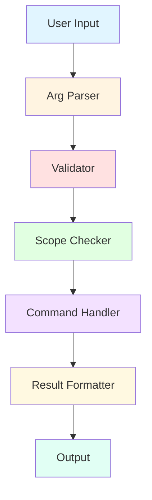
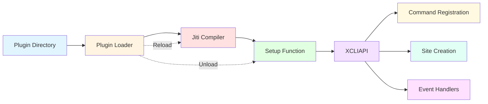
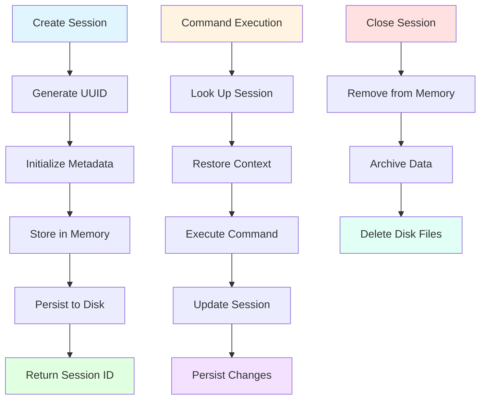
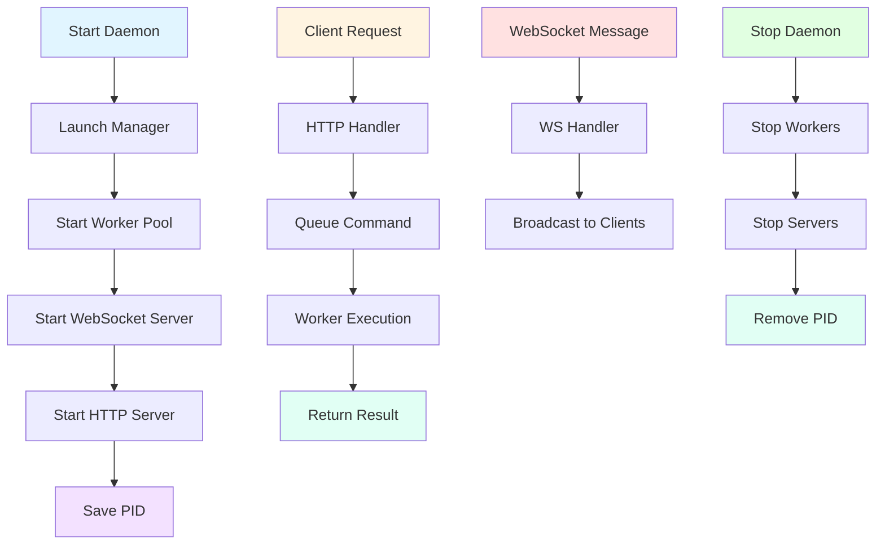
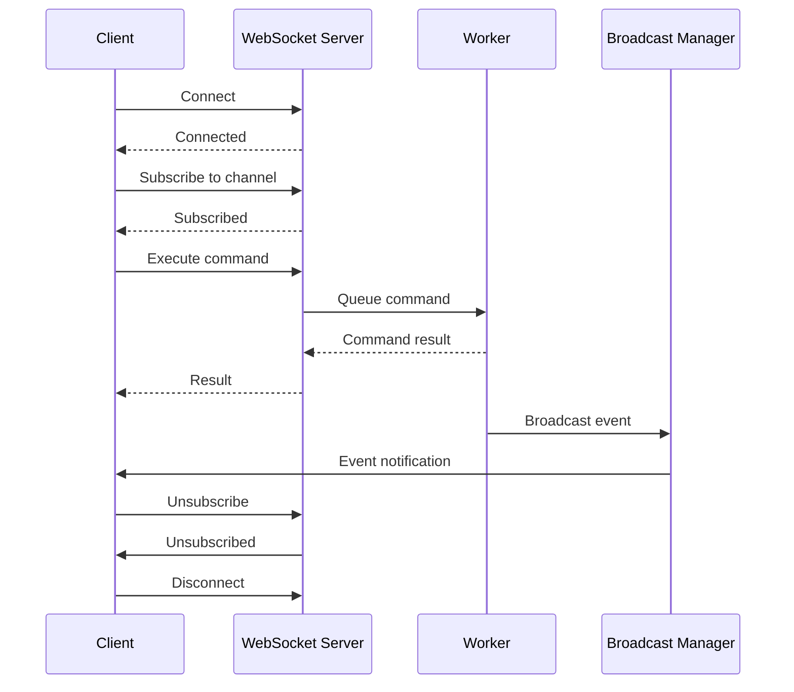
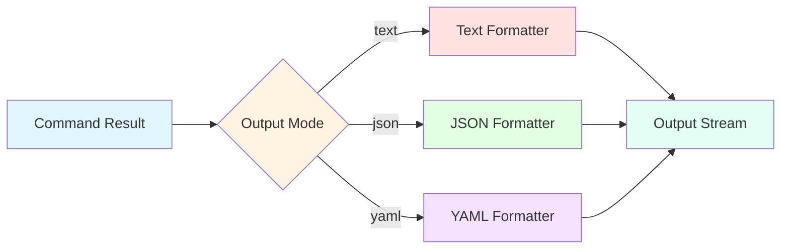
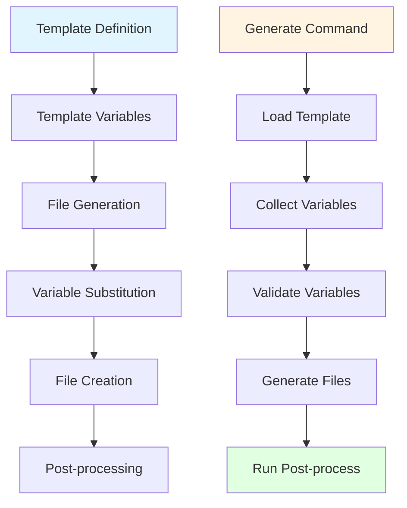

# Architecture

Overview of the @dyyz1993/xcli-core framework architecture.

## Design Philosophy

The framework is designed with these core principles:

1. **Domain Agnostic** — Works for any CLI domain (browser, database, API, etc.)
2. **Plugin Extensible** — Easy to extend through plugins
3. **Type Safe** — Full TypeScript support with Zod validation
4. **Minimal Dependencies** — Only essential dependencies (zod, jiti, ws)
5. **Composable** — Modules can be used independently or together

## Architecture Overview

```
┌─────────────────────────────────────────────────────────────┐
│                     Application Layer                        │
│                   (Your CLI Application)                      │
└────────────────────────┬────────────────────────────────────┘
                         │
                         ▼
┌─────────────────────────────────────────────────────────────┐
│                        Core Layer                            │
│  ┌──────────────┐  ┌──────────────┐  ┌──────────────┐       │
│  │  Command     │  │   Plugin     │  │    Scope     │       │
│  │  System      │  │   System     │  │  System      │       │
│  └──────────────┘  └──────────────┘  └──────────────┘       │
│  ┌──────────────┐  ┌──────────────┐  ┌──────────────┐       │
│  │    Output    │  │  Scaffolding │  │   Config     │       │
│  │  Formatting  │  │   Engine     │  │  Management  │       │
│  └──────────────┘  └──────────────┘  └──────────────┘       │
└────────────────────────┬────────────────────────────────────┘
                         │
                         ▼
┌─────────────────────────────────────────────────────────────┐
│                      Service Layer                           │
│  ┌──────────────┐  ┌──────────────┐  ┌──────────────┐       │
│  │   Session    │  │    Daemon    │  │  WebSocket   │       │
│  │  Management  │  │   Manager    │  │   Services   │       │
│  └──────────────┘  └──────────────┘  └──────────────┘       │
└────────────────────────┬────────────────────────────────────┘
                         │
                         ▼
┌─────────────────────────────────────────────────────────────┐
│                    Foundation Layer                          │
│  ┌──────────────┐  ┌──────────────┐  ┌──────────────┐       │
│  │   Arg Parser │  │  Validation  │  │   Storage    │       │
│  │              │  │   Engine     │  │   System     │       │
│  └──────────────┘  └──────────────┘  └──────────────┘       │
└─────────────────────────────────────────────────────────────┘
```

## Core Components

### 1. Command System

The command system is the heart of the framework.



**Key Files:**
- `src/command/scope.ts` — Scope definitions and registry
- `src/command/scope-registry.ts` — Scoped command management
- `src/command-result.ts` — Result types and utilities
- `src/arg-parser.ts` — Command line argument parsing
- `src/validator.ts` — Parameter validation

**Flow:**

1. **Input** — User provides command and arguments
2. **Parse** — Arg parser tokenizes and validates syntax
3. **Validate** — Zod schema validates parameter values
4. **Scope Check** — Ensures required context (browser, page, etc.)
5. **Execute** — Command handler runs with validated parameters
6. **Format** — Result formatted per output mode (text/json/yaml)
7. **Output** — Displayed to user

### 2. Plugin System

Plugin system enables extensibility without modifying core code.



**Key Files:**
- `src/plugin-loader.ts` — Plugin loading and management
- `src/plugin-storage.ts` — Plugin configuration storage
- `src/plugin/` — Plugin installation system

**Features:**
- Hot reload with jiti TypeScript compilation
- Multiple plugin directories (local, global, project)
- Plugin isolation and sandboxing
- Dependency management per plugin

### 3. Session Management

Session system maintains state across command executions.



**Key Files:**
- `src/session/session-manager.ts` — Session lifecycle
- `src/session/session-store.ts` — In-memory storage
- `src/session/session-archive.ts` — Archival and persistence
- `src/session/session-meta.ts` — Metadata types

**Features:**
- UUID-based session identification
- Metadata persistence (JSON)
- Command history tracking
- Archive system for replay

### 4. Daemon Management

Daemon system enables long-running background processes.



**Key Files:**
- `src/daemon/daemon-manager.ts` — Daemon lifecycle
- `src/daemon/worker-manager.ts` — Worker pool management
- `src/daemon/ws-server.ts` — WebSocket server
- `src/daemon/ws-client.ts` — WebSocket client
- `src/daemon/http-server.ts` — HTTP API server

**Features:**
- Multi-process worker pool
- WebSocket for real-time communication
- HTTP API for command execution
- Graceful shutdown handling
- Process management (PID tracking)

### 5. WebSocket Services

WebSocket services enable real-time bidirectional communication.



**Key Files:**
- `src/daemon/ws-server.ts` — Server implementation
- `src/daemon/ws-client.ts` — Client implementation
- `src/protocol/` — Message protocols

**Features:**
- Channel-based subscriptions
- Message broadcasting
- Event streaming
- Automatic reconnection

### 6. Output Formatting

Unified output system for consistent presentation.



**Key Files:**
- `src/output-formatter.ts` — Main formatter
- `src/output/` — Output strategies

**Features:**
- Multiple output modes (text, JSON, YAML)
- Pretty-printing options
- Color support for text output
- Error message formatting

### 7. Scaffolding Engine

Template-based code generation.



**Key Files:**
- `src/scaffold/index.ts` — Engine implementation
- Built-in templates (CLI, plugin, etc.)

**Features:**
- Variable substitution (`{{variable}}`)
- File copying with transformations
- Conditional file inclusion
- Post-processing hooks

## Data Flow

### Command Execution Flow

```
CLI Input
  ↓
Arg Parser (tokenize arguments)
  ↓
Validator (Zod schema validation)
  ↓
Scope Checker (verify context)
  ↓
Command Handler (execute logic)
  ↓
Result Wrapper (ok/fail)
  ↓
Output Formatter (format result)
  ↓
Display to User
```

### Plugin Loading Flow

```
Scan Plugin Directories
  ↓
Find index.ts files
  ↓
Jiti Compile (TypeScript)
  ↓
Execute setup(api)
  ↓
Register Commands
  ↓
Store Plugin Instance
```

### Session Lifecycle

```
Create Session
  ↓
Generate UUID
  ↓
Initialize Metadata
  ↓
Store in Memory
  ↓
Persist to Disk
  ↓
Return Session ID
  ↓
Execute Commands (using session)
  ↓
Update Metadata
  ↓
Persist Changes
  ↓
Close Session
  ↓
Archive Data
  ↓
Clean Up
```

## Module Dependencies

```
Core (entry point)
├── Command System
│   ├── Scope Registry
│   └── Result Types
├── Plugin System
│   └── Plugin Loader
├── Output System
│   └── Formatter
├── Session System
│   ├── Manager
│   ├── Store
│   └── Archive
├── Daemon System
│   ├── Daemon Manager
│   ├── Worker Manager
│   ├── WS Server
│   └── WS Client
├── Scaffolding
│   └── Engine
└── Configuration
    └── RC Config
```

## Design Patterns

### 1. Registry Pattern

Commands, plugins, and scopes use registry pattern for management.

```typescript
const commandRegistry = new Map<string, CommandEntry>();
const pluginRegistry = new Map<string, PluginInstance>();
const scopeRegistry = new ScopeRegistry();
```

### 2. Builder Pattern

Site creation uses builder pattern for fluent API.

```typescript
xcli.createSite({ name: 'mysite' })
  .command('cmd1', { ... })
  .command('cmd2', { ... })
  .login(async (ctx) => { ... });
```

### 3. Strategy Pattern

Output formatting uses strategy pattern for different formats.

```typescript
interface FormatterStrategy {
  format(result: CommandResult): string;
}

class JSONFormatter implements FormatterStrategy { ... }
class YAMLFormatter implements FormatterStrategy { ... }
class TextFormatter implements FormatterStrategy { ... }
```

### 4. Observer Pattern

WebSocket system uses observer pattern for event subscriptions.

```typescript
wsClient.on('message', (msg) => { ... });
wsClient.on('close', () => { ... });
```

## Extension Points

The framework provides several extension points:

1. **Custom Commands** — Register commands via `xcli.createSite().command()`
2. **Custom Scopes** — Define scope hierarchies via `ScopeRegistry`
3. **Custom Formatters** — Implement formatter strategies
4. **Custom Templates** — Add scaffolding templates
5. **Custom Installers** — Add plugin installers via `PluginInstallerRegistry`
6. **Custom Validators** — Extend validation rules

## Performance Considerations

1. **Lazy Loading** — Plugins loaded on demand
2. **Worker Pool** — Daemon uses worker pool for parallel execution
3. **Session Caching** — Sessions cached in memory with disk persistence
4. **WebSocket Streaming** — Real-time updates without polling

## Security Considerations

1. **Agent Guard** — Protects against malicious commands
2. **Plugin Sandboxing** — Plugins run in isolated context
3. **Input Validation** — All inputs validated via Zod schemas
4. **Process Isolation** — Daemon workers in separate processes

## See Also

- [Session Management](./session-management.md)
- [Daemon Management](./daemon-management.md)
- [Plugin System](./plugin-system.md)
- [WebSocket Integration](./websocket.md)
